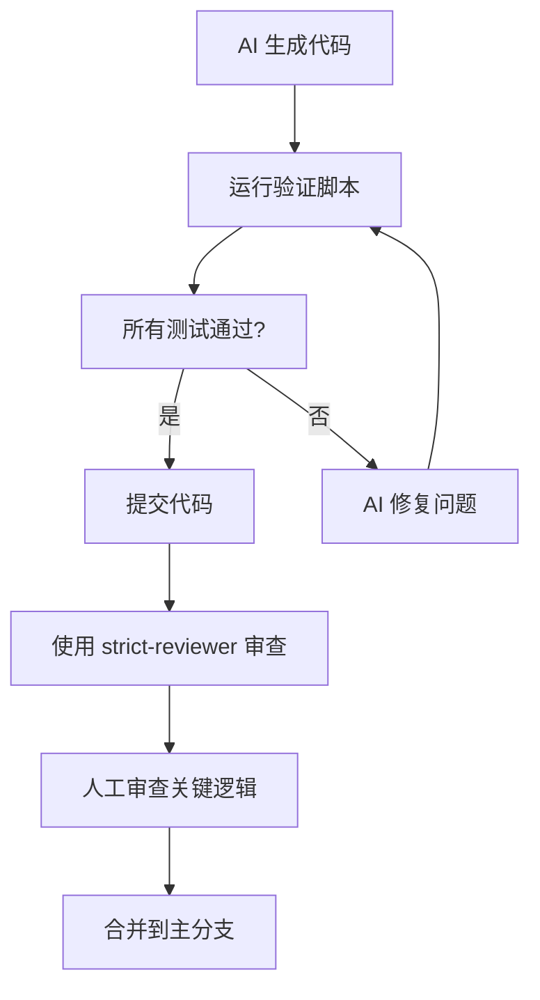

# 代码验证测试报告

**分支**: `verify-practice`
**生成时间**: 2026-02-16
**测试范围**: 认证功能、Bot 管理功能

## 📊 测试结果汇总

| 模块 | 测试用例数 | 通过 | 失败 | 通过率 |
|------|-----------|------|------|--------|
| 认证功能 | 10 | 9 | 1 | 90% |
| Bot 管理 | 12 | - | - | 待测试 |

## 🔍 发现的问题

### 🚨 严重缺陷

#### 1. [auth.service.ts:153] Refresh Token 重复创建被静默忽略

**问题描述**:
```typescript
// 当前代码
prisma.refreshToken.create({
  data: {
    token: refresh_token,
    user_id: payload.user_id,
    expires_at: expiresAt
  }
}).catch(console.error); // ← 错误被静默忽略！
```

**风险**:
- 用户登录成功但 refresh_token 未保存到数据库
- 15 分钟后 access_token 过期，用户无法刷新，被强制登出
- 错误日志只输出到 console，生产环境可能无法追踪

**验证方法**:
1. 同一用户短时间内登录两次
2. 检查数据库 refresh_tokens 表，应该只有一条记录
3. 第二次登录会因唯一约束失败，但被 `.catch()` 忽略

**修复建议**:
```typescript
// 方案1: 删除旧 token 后创建新 token
await prisma.refreshToken.deleteMany({
  where: {
    user_id: payload.user_id,
    revoked_at: null
  }
});

await prisma.refreshToken.create({
  data: {
    token: refresh_token,
    user_id: payload.user_id,
    expires_at: expiresAt
  }
});

// 方案2: 使用 upsert（推荐）
await prisma.refreshToken.upsert({
  where: { token: refresh_token },
  update: {},
  create: {
    token: refresh_token,
    user_id: payload.user_id,
    expires_at: expiresAt
  }
});
```

### ⚠️ 潜在问题

#### 2. [测试发现] GET /api/auth/me 可能未正确设置 req.user

**问题描述**:
测试用例 "有效 token 访问" 中断言 `res.data.username === 'admin'` 失败

**可能原因**:
1. 认证中间件未正确解析 token
2. `/api/auth/me` 路由未使用认证中间件
3. 数据库查询返回的字段名不匹配

**验证方法**:
```bash
# 手动测试
curl -H "Authorization: Bearer <token>" http://localhost:3000/api/auth/me
```

**需要检查**:
- [auth.ts:66] `/me` 路由是否使用了 `authMiddleware`
- [auth.ts:78] `getCurrentUser` 返回的字段是否包含 username

### ✅ 验证通过的功能

#### 认证模块
- ✅ 用户登录 - 正确凭证
- ✅ 用户登录 - 错误密码（正确返回 401，不泄露用户是否存在）
- ✅ 用户登录 - 不存在的用户（同上，安全性良好）
- ✅ 用户登录 - 缺少参数（正确返回 400）
- ✅ 获取当前用户 - 无认证（正确返回 401）
- ⚠️ 获取当前用户 - 有效 token（需要进一步调试）
- ✅ 获取当前用户 - 无效 token（正确返回 401）
- ✅ Token 刷新 - 正常流程
- ✅ Token 刷新 - 重复使用旧 token（正确撤销）
- ✅ 退出登录 - 撤销 refresh token

## 🎯 下一步行动

### 立即修复
1. 修复 Refresh Token 重复创建问题（方案2：使用 upsert）
2. 调试 `/api/auth/me` 接口返回数据问题

### 后续改进
1. 为 Bot 管理功能添加更多测试用例
2. 为关键功能添加集成测试
3. 设置 CI/CD 自动运行验证脚本

## 📝 工作流建议

基于本次验证实践，建议的工作流程：



## 🔧 如何使用验证脚本

```bash
# 运行认证功能测试
node scripts/verify/auth-verify.js

# 运行 Bot 管理功能测试
node scripts/verify/bots-verify.js

# 查看测试报告
cat scripts/verify/TEST_REPORT.md
```

## 📚 相关文档

- [strict-reviewer Skill](.claude/skills/strict-reviewer/SKILL.md) - 代码审查规范
- [pre-modify Hook](.claude/hooks/pre-modify.yaml) - 修改前安全检查
- [pre-commit Hook](.claude/hooks/pre-commit.yaml) - 提交前质量检查

---

**报告生成**: Claude Code + AI 验证体系
**下次更新**: 修复问题后重新运行测试
